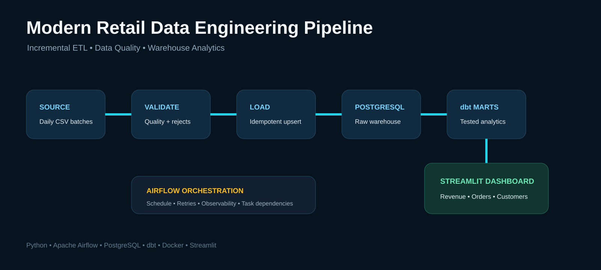
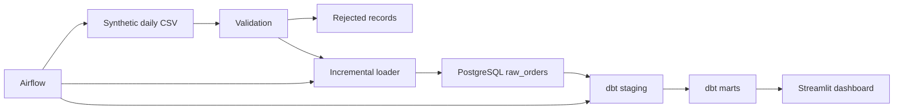
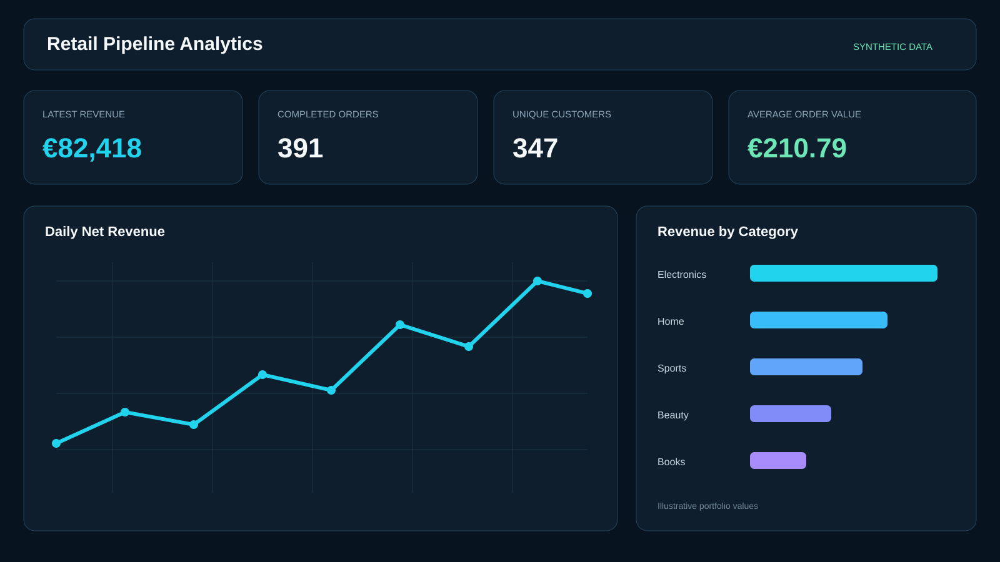

# Modern Retail Data Engineering Pipeline

An end-to-end portfolio project that generates synthetic retail events, validates and incrementally loads them into PostgreSQL, transforms warehouse data with dbt, orchestrates daily runs with Apache Airflow, and serves analytics through Streamlit.



## Why This Project Exists

The project demonstrates more than moving a CSV into a database. It focuses on the engineering concerns that make a pipeline dependable:

- Reproducible synthetic source data
- Explicit data contracts and validation
- Rejected-record handling
- Idempotent incremental loading
- File-level audit metadata
- Warehouse transformations and tests
- Workflow orchestration and retries
- Containerized local execution
- Business-facing analytical marts
- Automated code tests

## Architecture



## Stack

| Layer | Technology |
|---|---|
| Source simulation | Python |
| Validation and loading | Pandas, SQLAlchemy |
| Warehouse | PostgreSQL 16 |
| Transformation | dbt-postgres |
| Orchestration | Apache Airflow |
| Dashboard | Streamlit, Plotly |
| Packaging | Docker Compose |
| Quality | pytest, Ruff, dbt tests |

## Data Contract

Each synthetic order contains:

| Field | Meaning |
|---|---|
| `order_id` | Stable business key |
| `order_timestamp` | UTC event timestamp |
| `customer_id` | Synthetic customer identifier |
| `product_id` | Synthetic product identifier |
| `category` | Product category |
| `quantity` | Units ordered |
| `unit_price` | Synthetic unit price |
| `discount_pct` | Discount between 0 and 0.70 |
| `payment_method` | Card, wallet, or bank transfer |
| `city` | Synthetic market location |
| `order_status` | Completed, refunded, or cancelled |
| `updated_at` | Source update timestamp |

## Incremental and Idempotent Loading

Every source file receives a SHA-256 hash. Previously processed files are skipped. Accepted orders are upserted using `order_id`, allowing a later version of the same business record to update the warehouse without creating duplicates.

Invalid rows are written to `data/rejected/` with an explicit rejection reason. The load audit table stores:

- File hash
- File name
- Accepted row count
- Rejected row count
- Load timestamp

## dbt Models

### Staging

- `stg_orders`: typed, standardized orders with calculated gross revenue

### Marts

- `mart_daily_sales`: daily orders, revenue, customers, refund/cancellation counts, average order value
- `mart_category_performance`: revenue, units, orders, and discounts by category
- `mart_customer_summary`: first/last order, completed orders, lifetime value, category breadth

Tests cover key uniqueness, required values, and accepted statuses.

## Quick Start with Docker

Requirements: Docker and Docker Compose.

```bash
cp .env.example .env
docker compose up --build airflow-init
docker compose up --build -d
```

Open:

- Airflow: `http://localhost:8080`
- Streamlit: `http://localhost:8501`

The default credentials in `.env.example` are for local demonstration only. Change them before starting the stack and never reuse them in a real environment.

Enable and trigger the `retail_analytics_pipeline` DAG. The task order is:

```text
generate_daily_batch → validate_and_ingest → dbt_run → dbt_test
```

## Lightweight Local ETL Test

The ingestion layer defaults to SQLite when `DATABASE_URL` is not set, which makes the core logic easy to test without Docker:

```bash
python -m venv .venv
pip install -r requirements-dev.txt
python -m src.pipeline all --date 2026-09-18 --rows 500
pytest -q
```

This validates generation, quality rules, incremental loading, and idempotency. The full dbt/Airflow/dashboard path uses PostgreSQL through Docker Compose.

## Dashboard



The dashboard reads only modeled marts—not raw source files—so business users consume standardized warehouse outputs.

## Repository Structure

```text
├── airflow/dags/                 # Orchestration
├── dashboard/                    # Streamlit analytics
├── data/landing/                 # Generated source batches
├── data/rejected/                # Invalid records
├── dbt/models/staging/           # Standardization layer
├── dbt/models/marts/             # Analytical models
├── docker/                       # Container support
├── docs/                         # Architecture and publication kit
├── src/                          # Generator, validation, loader, CLI
├── tests/                        # Unit and integration-style tests
├── docker-compose.yml
├── Dockerfile
└── Makefile
```

## Engineering Decisions

- Synthetic data makes the repository public and reproducible.
- SHA-256 file tracking prevents accidental reprocessing.
- Upserts handle updated business records.
- Rejected rows remain inspectable instead of silently disappearing.
- dbt separates raw ingestion from business transformations.
- Airflow provides scheduling, retry behavior, and task visibility.
- SQLite enables fast automated tests; PostgreSQL remains the full-stack warehouse.

## Limitations

- Data is synthetic and does not represent real commercial performance.
- The pipeline is batch-oriented rather than streaming.
- Local demo credentials are not a production secret-management solution.
- Production deployment would require managed secrets, monitoring, backups, access control, and infrastructure hardening.

## Author

**Arash Adeli Nik** — AI & Data Automation Engineer  
[GitHub](https://github.com/ArashAdeliNik) · [LinkedIn](https://www.linkedin.com/in/arash-adeli-nik/)

